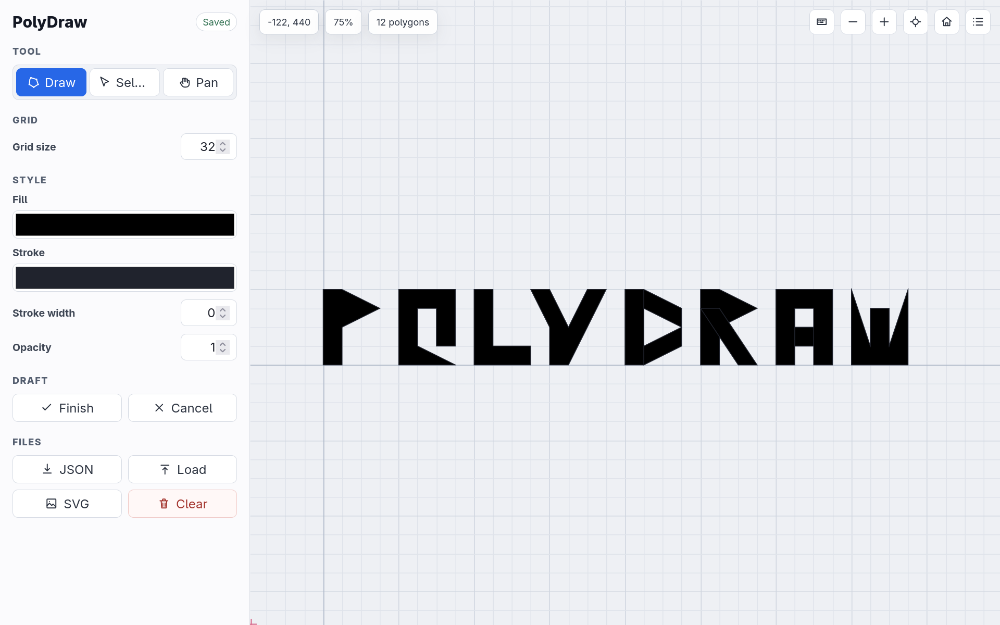

# PolyDraw

PolyDraw is a small TypeScript web app for drawing polygon-based artwork on an infinite grid canvas.



## Features

- Infinite canvas with pan and zoom
- Polygon drawing with grid-snapped vertices
- Hold `Shift` to place or move vertices off-grid using whole-number coordinates
- Select, move, restyle, and delete polygons
- Box-select multiple polygons
- Browser-local autosave
- Save and load drawings as JSON
- Export artwork as SVG
- Keyboard shortcuts, available in-app with `?`

## Local Development

Install dependencies:

```bash
npm install
```

Start the dev server:

```bash
npm run dev
```

Build for production:

```bash
npm run build
```

Preview the production build:

```bash
npm run preview
```

## Docker

Build and run the image:

```bash
docker build -t polydraw .
docker run --rm -p 8080:80 polydraw
```

Or use the example Compose file:

```bash
docker compose -f docker-compose.example.yml up --build
```

Then open `http://localhost:8080`.
